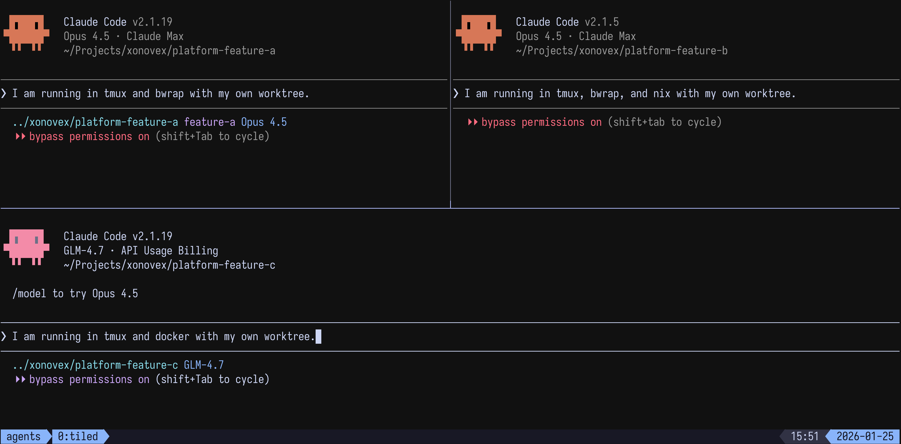

# Xonovex Platform


> Execution context manager for AI coding agents

AI coding agents handle prompts, tools, and code changes — they *are* the agent. What they don't control is the environment they run in: where the process executes, which model backs it, how the terminal session is managed, and whether the workspace is reproducible.

Xonovex manages everything *around* the agent: sandbox isolation, model provider routing, terminal session management, reproducible environments, and Kubernetes orchestration. It sets up the context, launches the agent, and gets out of the way.

<table><tr><td style="border: 2px solid gray; padding: 0;">

</td></tr></table>

## Packages

### Agent

| Package | Description |
|---------|-------------|
| [agent-cli](packages/agent/agent-cli/) | Unified CLI for running agents with sandbox, provider, and terminal options |
| [agent-cli-go](packages/agent/agent-cli-go/) | Go implementation of agent-cli (cross-platform binaries) |
| [agent-operator-go](packages/agent/agent-operator-go/) | Kubernetes operator for running agents as Jobs with managed workspaces |
| [agent-operator-go-docker](packages/agent/agent-operator-go-docker/) | Multi-arch Docker build and GHCR publish for agent-operator-go |

### Commands

| Package | Description |
|---------|-------------|
| [command-workflow](packages/command/command-workflow/) | Plan-driven development workflow with worktrees and parallel execution |
| [command-utility](packages/command/command-utility/) | Utility commands for content, instructions, insights, and skills |

### Shared

| Package | Description |
|---------|-------------|
| [shared-core](packages/shared/shared-core/) | Shared TypeScript library |
| [shared-core-go](packages/shared/shared-core-go/) | Shared Go library |
| [shared-agent-go](packages/shared/shared-agent-go/) | Shared Go agent library |

### Docker

| Package | Description |
|---------|-------------|
| [docker-agent](packages/docker/docker-agent/) | Docker Compose setup with custom provider support |

### Config

Shared configurations for ESLint, TypeScript, Vitest, Prettier, and Vite in [`packages/config/`](packages/config/).

### Skills

Coding guidelines and skill definitions in [`packages/skill/`](packages/skill/).

### Diagrams

Architecture and workflow diagrams in [`packages/diagram/`](packages/diagram/).

## Quick Start

```bash
# Install
npm install -g @xonovex/agent-cli

# Run an agent
agent-cli run --agent claude --sandbox bwrap
```

## Development

```bash
git clone https://github.com/xonovex/platform.git
cd platform && npm install
```

Tasks are managed with [Moon](https://moonrepo.dev/):

```bash
npx moon run <project>:<task>    # run a specific task
npx moon run :<task>             # run task across all projects
moon query projects              # list all projects
```

## License

MIT

---

See [CONTRIBUTING.md](CONTRIBUTING.md) for development setup and guidelines.
