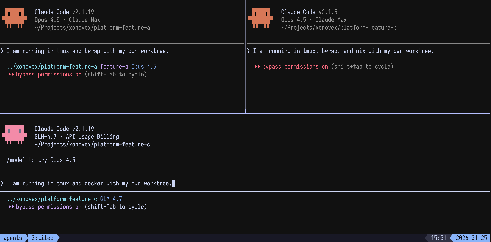

# Xonovex Platform Monorepo

  

> Run AI coding agents with explicit sandbox, provider, workspace, toolchain, and orchestration controls.

Use the Agent CLI for local runs, the Agent Operator for policy-governed Kubernetes Jobs, and the plugin catalog for reusable commands and skills.

Xonovex supports [Claude Code](https://docs.anthropic.com/en/docs/claude-code) and [OpenCode](https://github.com/anomalyco/opencode). It provides bubblewrap and Docker sandboxes, gVisor and Kata Containers isolation, [Confidential Containers (CoCo)](https://github.com/confidential-containers) with AMD SEV-SNP and Intel TDX, model routing through providers such as Gemini, GLM, and GPT, Git and [Jujutsu](https://github.com/jj-vcs/jj) workspaces, Nix toolchains, and Kubernetes orchestration.

The included skills are token-efficient, harness-neutral, and based on current research and best practices (Agent Skills spec, agentskills.io, agents.md). Skills provide instructions, references, scripts, and setup capabilities; installing one is not proof that a policy executes or blocks an action.

- **[agent-cli-go](packages/agent/agent-cli-go/)** configures sandboxes, providers, and terminal sessions, then launches the agent
- **[agent-operator-go](packages/agent/agent-operator-go/)** orchestrates agents as Kubernetes Jobs with managed workspaces, provider secrets, shared multi-agent workspaces, namespace-level policy enforcement, network isolation, and Nix toolchain provisioning
- **[moon-nix-toolchain](packages/moon/moon-nix-toolchain/)** wraps every Moon task in the repository's Nix flake dev shell, giving reproducible flake-pinned toolchains in local runs, pre-commit hooks, and CI
- **[Skills](packages/skill/)** give agents coding guidelines they follow automatically; plan-driven development with worktrees, project-instruction management, insight extraction, and skill authoring all live here as consolidated skill packages

## Quick Start

Choose the local Agent CLI, Kubernetes operator, or plugin installation path for the required use case.

### Agent CLI

Install the CLI and start a Claude Code run in a bubblewrap sandbox with the Gemini provider.

```bash
npm install -g @xonovex/agent-cli-go
agent-cli run --agent claude --isolation bwrap --provider gemini
```

Select the sandbox with three independent axes: `--isolation {none,bwrap,docker}`, `--provision {none,nix,command}`, and `--network {host,none,proxy}`. See `packages/agent/AGENTS.md` for the complete model.



Each pane is a separate worktree with its own axis combination and provider, so concurrent agents do not share a checkout or sandbox.

### Agent Kubernetes Operator

Install the operator only after the cluster has a digest-pinned agent image and a sandboxed RuntimeClass such as gVisor or Kata. Set these variables to values available in the cluster.

```bash
export XONOVEX_AGENT_IMAGE='ghcr.io/your-org/xonovex-agent@sha256:<64-hex-digest>'
export XONOVEX_RUNTIME_CLASS='gvisor'

# Requires cert-manager v1.16+ with its CA injector enabled
# Install CRDs and deploy the operator
kubectl apply -k https://github.com/xonovex/platform//packages/agent/agent-operator-go/config/crd
kubectl apply -k https://github.com/xonovex/platform//packages/agent/agent-operator-go/config/default

# Create one policy-governed namespace and provider credential
kubectl create namespace ai-agents --dry-run=client -o yaml | kubectl apply -f -
kubectl -n ai-agents create secret generic anthropic-credentials \
  --from-literal=api-key='your-key' \
  --dry-run=client -o yaml | kubectl apply -f -

kubectl apply -f - <<EOF
apiVersion: agent.xonovex.com/v1alpha1
kind: AgentPolicy
metadata:
  name: sandbox-policy
  namespace: ai-agents
spec:
  enforced:
    runtimeClassName: ${XONOVEX_RUNTIME_CLASS}
    requireSecurityContext: true
    requireNetworkPolicy: true
    maxTimeout: 1h0m0s
    maxResources:
      cpu: "2"
      memory: 4Gi
    allowedImages:
      - ${XONOVEX_AGENT_IMAGE}
    allowedRuntimeClassNames:
      - ${XONOVEX_RUNTIME_CLASS}
    allowedSecretNames:
      - anthropic-credentials
  defaults:
    image: ${XONOVEX_AGENT_IMAGE}
    runtimeClassName: ${XONOVEX_RUNTIME_CLASS}
    timeout: 30m0s
---
apiVersion: agent.xonovex.com/v1alpha1
kind: AgentProvider
metadata:
  name: anthropic-provider
  namespace: ai-agents
spec:
  displayName: Anthropic Claude
  authTokenSecretRef:
    name: anthropic-credentials
    key: api-key
  authTokenEnv: ANTHROPIC_API_KEY
  environment:
    ANTHROPIC_BASE_URL: https://api.anthropic.com
---
apiVersion: agent.xonovex.com/v1alpha1
kind: AgentRun
metadata:
  name: review-code
  namespace: ai-agents
spec:
  harness:
    type: claude
  providerRef: anthropic-provider
  workspace:
    type: git
    repository:
      url: https://github.com/xonovex/platform.git
      branch: main
  prompt: "Review the codebase and suggest improvements"
  network: host
  resources:
    requests:
      cpu: 500m
      memory: 512Mi
    limits:
      cpu: "2"
      memory: 2Gi
EOF
```

The `network: host` value permits unrestricted egress so this example can reach the public model API. Production namespaces should use an enforceable cluster-level egress proxy or a fully qualified domain name aware policy.

### Agent Plugins

Install only the plugins required for the intended operations. A compatible harness can route to an installed skill when its description matches the task. User-invocable commands load their required skill dependencies explicitly. Harness support, loading behavior, permissions, and native enforcement remain product-specific. The skills follow the [Agent Skills specification](https://agentskills.io/specification).

#### Claude Code

Add the marketplace, then install the required command and skill plugins.

```bash
# Add the Xonovex plugin marketplace
claude plugin marketplace add xonovex/platform

# Install only the independent capabilities you need
claude plugin install xonovex-workflow@xonovex-marketplace            # explicit operations, context forwarding, publishing, and workspace commands
claude plugin install xonovex-skill-plan@xonovex-marketplace          # research, create, critique, revise, expand, continue, update, validate
claude plugin install xonovex-skill-git@xonovex-marketplace           # commit, merge-resolve, feature-worktree create/merge/abandon/cleanup
claude plugin install xonovex-skill-github@xonovex-marketplace        # GitHub issues, Projects, PRs/reviews, durable context, enforcement
claude plugin install xonovex-skill-gitlab@xonovex-marketplace        # GitLab issues/work items, boards, MRs/reviews, durable context, enforcement
claude plugin install xonovex-skill-instruction@xonovex-marketplace   # AGENTS.md init / sync / simplify / consolidate / merge
claude plugin install xonovex-skill-reflect@xonovex-marketplace       # session reflection: extract lessons, fold into AGENTS.md or a skill
claude plugin install xonovex-skill-code-review@xonovex-marketplace   # Conventional Comments feedback: blocking vs non-blocking, summary + inline
claude plugin install xonovex-skill-pull-request@xonovex-marketplace  # PR authoring: description, size/atomicity, testing evidence, tradeoffs, self-review
claude plugin install xonovex-skill-command@xonovex-marketplace        # author / merge / simplify reusable prompt files (cross-harness format reference)
claude plugin install xonovex-skill-skill@xonovex-marketplace         # author / extract / merge / simplify / validate Agent Skills
claude plugin install xonovex-skill-content@xonovex-marketplace       # multilingual articles, news, travel guides, prose humanization
claude plugin install xonovex-skill-llmstxt@xonovex-marketplace       # /llms.txt files and per-page markdown mirrors

# Install language / framework guides (apply automatically when editing those files)
claude plugin install xonovex-skill-typescript@xonovex-marketplace
claude plugin install xonovex-skill-react@xonovex-marketplace
claude plugin install xonovex-skill-hono@xonovex-marketplace
claude plugin install xonovex-skill-zod@xonovex-marketplace
claude plugin install xonovex-skill-vitest@xonovex-marketplace
# ... see .claude-plugin/marketplace.json for the full list
```

#### Codex

Add the marketplace, then install the required skill plugins.

```bash
# Add the Xonovex plugin marketplace
codex plugin marketplace add xonovex/platform

# Install only the independent capabilities you need
codex plugin add xonovex-skill-plan@xonovex-marketplace          # research, create, critique, revise, expand, continue, update, validate
codex plugin add xonovex-skill-git@xonovex-marketplace           # commit, merge-resolve, feature-worktree create/merge/abandon/cleanup
codex plugin add xonovex-skill-github@xonovex-marketplace        # GitHub issues, Projects, PRs/reviews, durable context, enforcement
codex plugin add xonovex-skill-gitlab@xonovex-marketplace        # GitLab issues/work items, boards, MRs/reviews, durable context, enforcement
codex plugin add xonovex-skill-instruction@xonovex-marketplace   # AGENTS.md init / sync / simplify / consolidate / merge
codex plugin add xonovex-skill-reflect@xonovex-marketplace       # session reflection: extract lessons, fold into AGENTS.md or a skill
codex plugin add xonovex-skill-code-review@xonovex-marketplace   # Conventional Comments feedback: blocking vs non-blocking, summary + inline
codex plugin add xonovex-skill-pull-request@xonovex-marketplace  # PR authoring: description, size/atomicity, testing evidence, tradeoffs, self-review
codex plugin add xonovex-skill-command@xonovex-marketplace        # author / merge / simplify reusable prompt files (cross-harness format reference)
codex plugin add xonovex-skill-skill@xonovex-marketplace         # author / extract / merge / simplify / validate Agent Skills
codex plugin add xonovex-skill-content@xonovex-marketplace       # multilingual articles, news, travel guides, prose humanization
codex plugin add xonovex-skill-llmstxt@xonovex-marketplace       # /llms.txt files and per-page markdown mirrors

# Install language / framework guides (apply automatically when editing those files)
codex plugin add xonovex-skill-typescript@xonovex-marketplace
codex plugin add xonovex-skill-react@xonovex-marketplace
codex plugin add xonovex-skill-hono@xonovex-marketplace
codex plugin add xonovex-skill-zod@xonovex-marketplace
codex plugin add xonovex-skill-vitest@xonovex-marketplace
# ... see .agents/plugins/marketplace.json for the full list
```

### Upgrades and retired skill plugins

Upgrade the marketplace and selected plugins together, then start a new session. Remove the four retired pre-5.x plugin names before installing their replacements.

| Retired plugin              | Replacement             |
| --------------------------- | ----------------------- |
| `xonovex-skill-general-fp`  | `xonovex-skill-fp`      |
| `xonovex-skill-general-oop` | `xonovex-skill-oop`     |
| `xonovex-skill-insights`    | `xonovex-skill-reflect` |
| `xonovex-skill-prompt`      | `xonovex-skill-command` |

In Codex CLI, open `codex`, run `/plugins`, select each retired installed entry, and choose **Uninstall plugin**; then install its replacement. For Claude Code user-scope installations:

```bash
claude plugin uninstall xonovex-skill-general-fp@xonovex-marketplace
claude plugin uninstall xonovex-skill-general-oop@xonovex-marketplace
claude plugin uninstall xonovex-skill-insights@xonovex-marketplace
claude plugin uninstall xonovex-skill-prompt@xonovex-marketplace
```

## Development

Install workspace dependencies before running Moon tasks and repository gates.

```bash
git clone https://github.com/xonovex/platform.git
cd platform && npm install
```

[Moon](https://moonrepo.dev/) manages project tasks.

```bash
npx moon run <project>:<task>    # run a specific task
npx moon run :<task>             # run a single-colon task across matching projects
npm run fmt:check                # run the repository format-check aggregate
npx moon query projects          # list all projects
```

## License

The repository uses the MIT License.

---

See [CONTRIBUTING.md](CONTRIBUTING.md) for the complete development setup and contribution guidelines.
