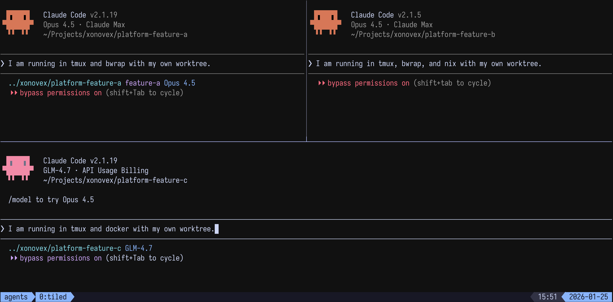

# Xonovex Platform Monorepo

Run coding agents locally with the Agent CLI, run policy-governed Kubernetes Jobs with the Agent Operator, or install grouped plugins for reusable skills and commands.

  

## Choose an entry point

Choose the component that matches the task. Skills provide instructions and supporting resources; installed guidance alone does not enforce a policy.

| Task | Start here |
| --- | --- |
| Run Claude Code or OpenCode locally | [Agent CLI](packages/tooling/cli/agent-cli-go/README.md) |
| Run agents as Kubernetes Jobs | [Agent Operator quick start](packages/sandbox/operator/agent-operator-go/docs/quick-start.md) |
| Install skills and commands | [Plugin catalog](#agent-plugins) |
| Follow the development workflow | [Workflow guide and diagrams](packages/runtime/plugin/plugin-workflow/README.md) |
| Create or update visual documentation | [Xonovex design](DESIGN.md) |
| Run Moon tasks in pinned Nix environments | [Moon Nix toolchain](packages/tooling/moon/moon-nix-toolchain/README.md) |
| Change or release the repository | [Contributing guide](CONTRIBUTING.md) |

The CLI and operator support Claude Code and OpenCode, model-provider routing, Git and Jujutsu workspaces, and Nix provisioning. The CLI offers bubblewrap and Docker isolation. The operator uses cluster-provided gVisor, Kata, and Confidential Containers runtime classes. Each component documents its requirements and guarantees.

## Quick Start

Choose the local Agent CLI, Kubernetes operator, or plugin installation path for the required use case.

### Agent CLI

Install the CLI and start a Claude Code run in a bubblewrap sandbox with the Gemini provider.

```bash
npm install -g @xonovex/agent-cli-go
agent-cli run --agent claude --isolation bwrap --provider gemini
```

Select isolation, provisioning, and network behavior independently. Use `agent-cli run --dry-run` to inspect the resolved configuration. The [CLI reference](packages/tooling/cli/agent-cli-go/README.md#run) lists supported flags, and the [agent execution policy](packages/AGENTS.md#agent-execution-policy) defines the guarantees.



Each pane is a separate worktree with its own axis combination and provider, so concurrent agents do not share a checkout or sandbox.

### Agent Kubernetes Operator

Follow the [operator quick start](packages/sandbox/operator/agent-operator-go/docs/quick-start.md) to install the operator, create an execution policy, configure credentials, and submit an AgentRun. It requires cert-manager, a digest-pinned agent image, and a sandboxed RuntimeClass already available in the cluster.

### Agent Plugins

Install the grouped plugins your tasks need. Each plugin owns related skills and commands. A skill keeps its existing name, and a command uses the namespace of the plugin that owns it.

| Plugin | Purpose |
| --- | --- |
| [`xonovex-agentic`](packages/runtime/plugin/plugin-agentic/README.md) | Configure coding-agent harnesses and author their skills, commands, and project instructions. |
| [`xonovex-core`](packages/runtime/plugin/plugin-core/README.md) | Apply software design, testing, review, version control, credentials, and accessibility practices. |
| [`xonovex-game-engine`](packages/runtime/plugin/plugin-game-engine/README.md) | Build game engines, renderers, audio systems, editors, asset pipelines, and multiplayer networking. |
| [`xonovex-integrations`](packages/runtime/plugin/plugin-integrations/README.md) | Use GitHub and GitLab for issues, pull requests, delivery, and continuous integration. |
| [`xonovex-languages`](packages/runtime/plugin/plugin-languages/README.md) | Write Python, shell, SQL, and Lua, including TypeScript compiled to Lua. |
| [`xonovex-native`](packages/runtime/plugin/plugin-native/README.md) | Write C99 and build portable native systems with explicit memory, concurrency, and data layouts. |
| [`xonovex-platform`](packages/runtime/plugin/plugin-platform/README.md) | Configure Moon tasks and build and operate Docker images, Kubernetes workloads, and Terraform infrastructure. |
| [`xonovex-typescript`](packages/runtime/plugin/plugin-typescript/README.md) | Develop the TypeScript stack, its frameworks, package tooling, validation, and tests. |
| [`xonovex-workflow`](packages/runtime/plugin/plugin-workflow/README.md) | Research, plan, implement, validate, and close out work, then integrate lessons from the session. |
| [`xonovex-writing`](packages/runtime/plugin/plugin-writing/README.md) | Revise prose and write technical documents, articles, news, and travel guides. |

#### Claude Code

Add the marketplace, then install the plugins needed for the task:

```bash
claude plugin marketplace add xonovex/platform
claude plugin install xonovex-core@xonovex-marketplace
claude plugin install xonovex-workflow@xonovex-marketplace
claude plugin install xonovex-typescript@xonovex-marketplace
```

#### Codex

Add the marketplace, then install the plugins needed for the task:

```bash
codex plugin marketplace add xonovex/platform
codex plugin add xonovex-core@xonovex-marketplace
codex plugin add xonovex-workflow@xonovex-marketplace
codex plugin add xonovex-typescript@xonovex-marketplace
```

#### Upgrade from individual plugins

The grouped plugins replace the individual `xonovex-skill-*` plugins and `xonovex-utility`. Install the group that owns each skill, then uninstall its old individual plugin to prevent duplicate skill registration. The `xonovex-workflow` plugin now contains the planning and reflection skills and their commands. Git commands and the existing `plan-worktree-*` commands belong to `xonovex-core`; authoring commands belong to `xonovex-agentic`; content commands belong to `xonovex-writing`.

## Development

Install workspace dependencies before running Moon tasks and repository gates.

```bash
git clone https://github.com/xonovex/platform.git
cd platform && npm install
```

[Moon](https://moonrepo.dev/) manages project tasks. The [contributing guide](CONTRIBUTING.md) describes validation and release rules.

```bash
npx moon run <project>:<task>    # run a specific task
npx moon run :<task>             # run a single-colon task across matching projects
npm run fmt:check                # run the repository format-check aggregate
npx moon query projects          # list all projects
```

## License

The repository uses the MIT License.

See [CONTRIBUTING.md](CONTRIBUTING.md) for the complete development setup and contribution guidelines.
